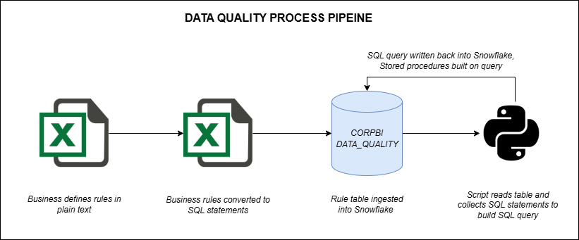

# data-quality-rules-engine

This diagram represents a real-world data quality rules framework I developed.

## Workflow Overview

1. **Business users define rules** in plain English inside Excel
2. A second Excel tab converts rules to **parameterized SQL statements**
3. Rules are **ingested into Snowflake** as a table.
4. A Python script reads these rows and dynamically builds a consolidated SQL query
5. This query is used in **stored procedures** and **testing dashboards**

## Tools Used

- Excel for rule capture and transformation
- Snowflake for rule storage and validation execution
- Python to generate SQL dynamically and integrate testing logic
- Stored procedures to support automated QA pipelines

## Why It Matters

This approach empowered business users to define their own rules while ensuring technical enforcement was consistent and scalable. It made our data quality processes transparent, testable, and fast to iterate.

